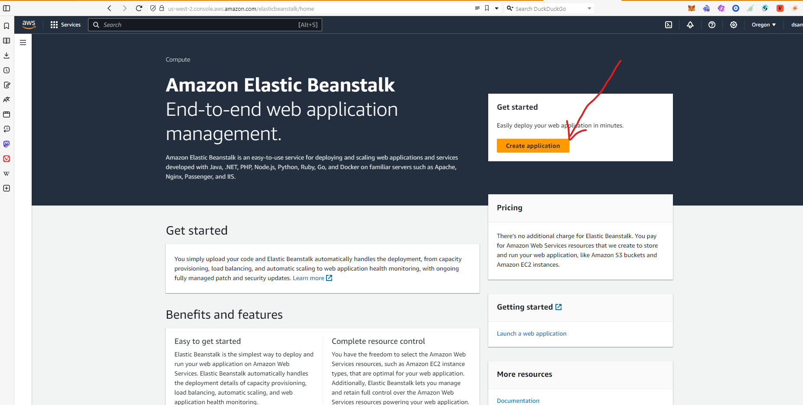
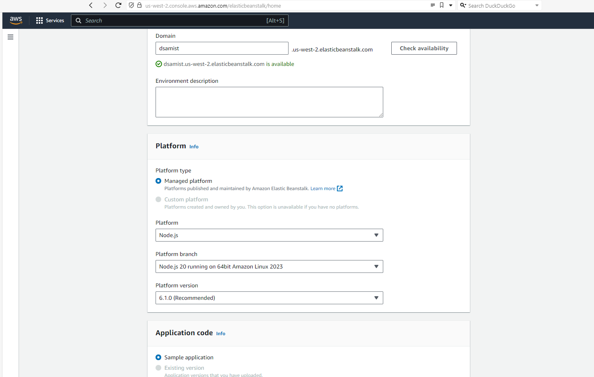

## CI/CD with AWS

The aim of this project is to build a CI/CD pipeline using AWS. 

The project is inspired from the walkthrough found on the AWS website [aws_ci_cd](https://aws.amazon.com/getting-started/hands-on/create-continuous-delivery-pipeline/).

The tools needed to finish and set this up are:

    1. A github account

    2. AWS Elastic Beanstalk: This is a service offered by AWS that helps simplifies the deployment and scaling of web applications. It is easy to use and has preconfigirations (underlying libraries and infrastructures) that fits your application codes.

    3. AWS CodeBuild: This is also a service provided by aws that simplifies the building and testing process of your application code.

    4. AWS CodePipeline: Another service also provided by aws that automate the process of releasing software into the AWS cloud.

    5. An AWS account (kinda forgotten this, :) it should be at the top as well, because you need an aws account to begin with, before having to use the services listed above)

The application used for this learning is gotten from github [aws-elastic-beanstalk](https://github.com/aws-samples/aws-elastic-beanstalk-express-js-sample)

## Deploying the sample app to AWS elastic beanstalk

This section involves the process of deploying the application to beanstalk:

1. Go to the aws elastic beanstalk console [console](https://console.aws.amazon.com/elasticbeanstalk/home?region=us-west-2#/welcome)

2. From the console, click on creat application, this is an orange button at the top right of the page [image](./screenshots/EB-home.png)

3. Fill in the required details on the naex page like the application name, the enviroment type is a web server, because this is a nodejs application, the platform to also use is nodejs. Select the source of your application code, there are two options there, however, for the sake of this tutorial, we will be sticking with sample application because we are using our application code from a git repository. The other option allows you to upload code from your computer or from an amazon storage (s3) [image](./screenshots/details1.pngdetails1.png)  

4. On the next page, create a new service role, if none is available for use.  Skip to review and submit.

5. Wait for environment to complete setup.

6. Once setup is complete, click on the domain name in the enviroment overview page to launch the default page of elastci beanstalk [image]()